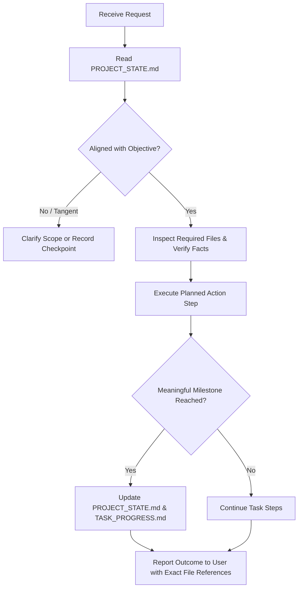

# AI Agent Operating Guidelines & Rules (AGENTS.md)
**Project**: Shree Ashirwad Packers and Movers (`shreeashirwadpackers`)  
**Scope**: Permanent behavioral rules and operating protocol for all AI assistants, agents, and subagents.

---

## 1. Core Operating Principles

### A. Strict Focus & Anti-Drift
1. **Stick to the Active Task**: Never broaden scope or take initiative on unrelated files, features, or architectural overhauls unless the user explicitly requests it.
2. **Anti-Drift Verification**: Before taking major actions, verify that the action directly serves the `Current Objective` recorded in [`PROJECT_STATE.md`](file:///d:/shreeashirwadpackers/PROJECT_STATE.md).
3. **Handle Topic Switches Deliberately**: If the user raises an unrelated question or request during an active task:
   - Clarify whether this is an ad-hoc informational question or an intentional task switch.
   - If switching tasks, record the checkpoint of the current task in [`PROJECT_STATE.md`](file:///d:/shreeashirwadpackers/PROJECT_STATE.md) first before transitioning.

### B. Verify Before Concluding (Zero Assumptions)
1. **Never Assume**: Never speculate about file contents, server configuration, database state, routing rules, or previous user actions. Always inspect the source directly with read tools.
2. **Explicit Fact vs. Assumption Separation**:
   - **Verified Fact**: Information confirmed by reading actual file lines, tool outputs, or Git logs (must reference the exact file and line number).
   - **Assumption / Hypothesis**: Any inferred or unverified belief. Must be explicitly tagged `[ASSUMPTION - PENDING VERIFICATION]` and verified before any action is taken.
3. **Ask When Information Is Missing**: If a required credential, business rule, or specification is absent, stop and ask the user rather than guessing or inventing placeholders.

### C. Persistent Memory & State Continuity
1. **Mandatory Start/Resume Check**:
   - Before answering or starting work on a non-trivial request, always read [`PROJECT_STATE.md`](file:///d:/shreeashirwadpackers/PROJECT_STATE.md).
   - Check what work is already marked `Completed`, what is `Pending`, what files have already been inspected, and what `Next Action` was scheduled.
2. **Do Not Repeat Completed Work**: Do not re-inspect, re-test, or re-write solutions for tasks marked completed in [`PROJECT_STATE.md`](file:///d:/shreeashirwadpackers/PROJECT_STATE.md) or [`TASK_PROGRESS.md`](file:///d:/shreeashirwadpackers/TASK_PROGRESS.md) unless explicitly asked to re-verify.
3. **Respect Past Decisions**: All architectural, structural, and procedural decisions logged in the "Important Decisions" section of [`PROJECT_STATE.md`](file:///d:/shreeashirwadpackers/PROJECT_STATE.md) are binding. Do not silently reverse or alter past decisions.

### D. Milestone-Based Progress Tracking
1. **Meaningful Milestone Updates**: For multi-step or long-running tasks, update [`TASK_PROGRESS.md`](file:///d:/shreeashirwadpackers/TASK_PROGRESS.md) and [`PROJECT_STATE.md`](file:///d:/shreeashirwadpackers/PROJECT_STATE.md) at meaningful milestones (e.g., phase completion, blocker discovered, transition to new phase)—**never** after every micro-action or single tool call.
2. **Clean State Handoff**: At the conclusion of every milestone or task, leave [`PROJECT_STATE.md`](file:///d:/shreeashirwadpackers/PROJECT_STATE.md) in a clean, unambiguous state so that a subsequent session or compacted conversation can resume without loss of context.

---

## 2. Production & Code Safety Boundaries

Unless a user prompt explicitly commands code modification for a specific task:
1. **Do NOT modify** production PHP templates (`pages/`, `includes/`, `router.php`, `index.php`).
2. **Do NOT modify** web server configurations (`.htaccess`, `robots.txt`).
3. **Do NOT touch** dependencies, package files, or credentials (`service_account.json`, `.env`).
4. **Do NOT rename, delete, or rewrite** existing assets, database dumps, or audit documents (`problem/`, `data/`).
5. **Keep Agent Infrastructure Isolated**: All persistent agent context files (`AGENTS.md`, `PROJECT_STATE.md`, `TASK_PROGRESS.md`, `.agents/`) must remain completely decoupled from website runtime code.

---

## 3. Standard Task Execution Flow

Every task must adhere to the following sequence:

---

## 4. Reference to Skills
For detailed protocols on recovering context, handling conversation compaction, and updating state files, activate and refer to the workspace skill:
- [`.agents/skills/task-continuity/SKILL.md`](file:///d:/shreeashirwadpackers/.agents/skills/task-continuity/SKILL.md)
